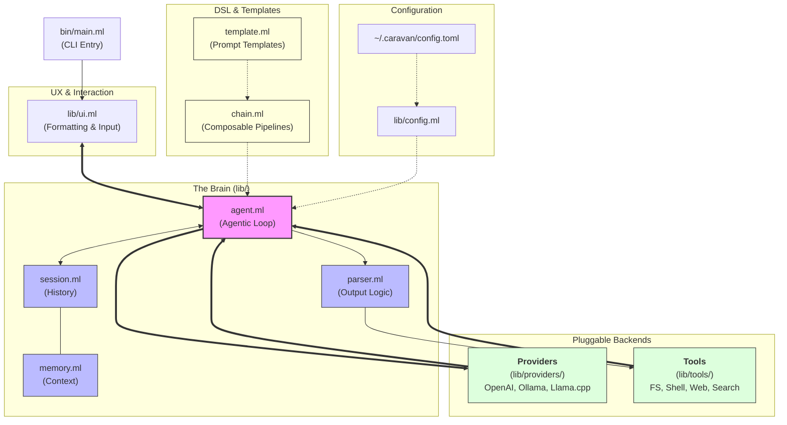

# Caravan

**Caravan** is a functional, type-safe LLM orchestration framework for OCaml. It provides a structured way to build, compose, and deploy LLM pipelines with strong compile-time guarantees, leveraging OCaml 5's algebraic effects and Eio for concurrency.

Inspired by LangChain but designed for the OCaml ecosystem, Caravan models LLM interactions as typed functions flowing through composable "chains."

## Key Features

- **Typed Chains**: Compose pipelines using the `|>>` operator (Result bind). Every step is a typed function `'a -> ('b, string) result`.
- **Eio-Powered**: Built on **Eio** for high-performance, multicore-ready asynchronous I/O.
- **Algebraic Effects**: Uses OCaml 5 effects for clean, decoupled tool execution and provider interactions.
- **Autonomous Agents**: Support for ReAct-style agentic loops that can use tools to solve complex tasks.
- **Extensible Tools**: Define tools with simple JSON schemas and type-safe execution.
- **Pluggable Providers**: Support for **Ollama** (local), **OpenAI-compatible** APIs (Groq, Together, etc.), and **llama.cpp**.
- **Typed Parsers**: Transform raw LLM strings into structured OCaml data (JSON, lists, booleans, code blocks) with built-in validation.
- **Prompt Templates**: Logic-less mustache-style templates (`{{variable}}`) with variable extraction and validation.
- **Pluggable & Decoupled Memory**: Decoupled session context via OCaml 5 first-class modules (`Memory.packed_memory`). Built-in support for sliding-window buffers, **Redis** (for multi-process shared agent context), and **Hierarchical Memory** (automatic LLM-powered summary compilation to mitigate context blow-up).
- **Interactive TUI**: A feature-rich REPL for testing prompts, running agents, and exploring models.

## Installation

Caravan requires OCaml 5.0+ and Dune.

```bash
# Clone the repository
git clone https://github.com/adukhan99/Caravan.git
cd Caravan

# Install dependencies
opam install . --deps-only

# Build the project
dune build
```

## Quick Start: The Library

Building a typed pipeline that takes a topic and returns a list of facts:

```ocaml
open Caravan
open Caravan.Chain

let fact_chain net provider =
  (* 1. Define the prompt template *)
  prompt_template "List 3 interesting facts about {{topic}}." 
  
  (* 2. Send to the LLM *)
  |>> llm net provider 
  
  (* 3. Parse the output into a string list *)
  |>> parse Parser.numbered_list

let () = Eio_main.run (fun env ->
  let provider = CaravanProviders.Ollama.make_provider ~model:"llama3.2" () in
  let result = run (fact_chain env#net provider) [("topic", "OCaml")] in
  match result with
  | Ok facts -> List.iter (Printf.printf "- %s\n") facts
  | Error e  -> Printf.eprintf "Error: %s\n" e
)
```

## Quick Start: The TUI

Caravan comes with a powerful CLI tool for interactive use. It is highly recommended to set up a [configuration file](docs/configuration.md) to manage your provider settings and API keys.

```bash
# Start the REPL (uses local Ollama by default)
dune exec caravan

# Use OpenAI-compatible provider
export OPENAI_API_KEY="sk-..."
dune exec caravan -- --provider openai --model gpt-4o

# Run a single completion
dune exec caravan complete "Why is functional programming useful?"
```

### REPL Slash Commands

Inside the REPL, use these commands to control the session:
- `/model <name>`: Switch the active model.
- `/agent <task>`: Start an autonomous agentic loop to solve a task.
- `/system <text>`: Set a persistent system instruction.
- `/memory <n>`: Set the sliding window size (0 for unlimited).
- `/tools`: List available tools for the agent.
- `/models`: List models available on the current provider.
- `/export [file.json]`: Export the full conversation history.

## Configuration

Caravan can be configured via a TOML file at `~/.caravan/config.toml` or via environment variables.

See the [Configuration Guide](docs/configuration.md) for a full list of available options and an [example_config.toml](example_config.toml).

### Quick Setup

```bash
mkdir -p ~/.caravan
cp example_config.toml ~/.caravan/config.toml
# Edit the file with your API keys and preferred model
```

## Architecture

Caravan is built with a modular architecture that separates the core logic from the pluggable backends and tools.



- **`Caravan.Types`**
: Foundational types for messages, roles, and results.
- **`Caravan.Chain`**: The core DSL for pipeline composition.
- **`Caravan.Agent`**: Logic for autonomous ReAct loops.
- **`Caravan.Tool`**: Effect-based tool definition and dispatch.
- **`Caravan.Provider`**: Abstract interface for LLM backends.
- **`Caravan.Parser`**: Combinators for turning text into types.
- **`Caravan.Session`**: Higher-level manager for stateful chat and tools.

## License

GPL-3.0-or-later
