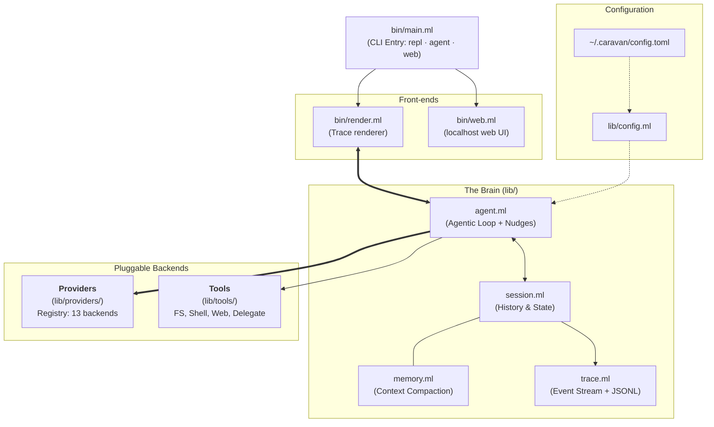

# Caravan

**Caravan** is a typed, self-documenting agentic CLI harness and LLM
orchestration framework for OCaml. It gives you a working autonomous agent
out of the box — tools, providers, permissions, transcripts — while staying
light enough for HPC nodes, containers, and non-root environments.

Built on OCaml 5 algebraic effects and Eio. "Correct, efficient, beautiful."

## Why Caravan

- **Accountable by construction**: every model call, tool call, nudge, and
  summarization is a structured event; each session writes an auditable
  JSONL transcript to `~/.caravan/logs/`.
- **Batteries included, hygiene preserved**: one static binary, no runtime
  file spew, config in a single 0600 TOML file.
- **Models of every weight**: 13 providers out of the box — from a 1B
  llama on your laptop through Groq-hosted 70Bs to Claude, GPT-4o, and
  Gemini — behind one interface and one config file.
- **Typed all the way down**: pipelines are `'a -> ('b, string) result`
  functions, tools are first-class modules with typed inputs/outputs,
  providers and memories are packed existentials.

## Install

```bash
# One-liner (installs deps, builds, puts `caravan` on your PATH):
curl -fsSL https://raw.githubusercontent.com/adukhan99/Caravan/main/scripts/install.sh | bash

caravan init      # guided setup: provider, model, API key (input hidden)
caravan doctor    # verify everything works
```

Manual build (OCaml ≥ 5.1, dune ≥ 3.21):

```bash
git clone https://github.com/adukhan99/Caravan.git && cd Caravan
opam install . --deps-only --with-test -y
dune build
dune exec caravan -- init
```

## The CLI

```bash
caravan                              # interactive REPL (default)
caravan agent "fix the failing test" # one-shot autonomous run
caravan agent "audit deps" --json    # scripting: one JSON object out
caravan complete "why is FP useful?" # single completion
caravan web                          # local web UI on 127.0.0.1:8787
caravan providers                    # provider table + key status
caravan providers --ladder           # a good model per weight class
caravan models                       # models on the current provider
caravan config set permissions ask   # edit config from the CLI
caravan doctor                       # diagnostics
```

Every command accepts `-p/--provider`, `-m/--model`, `--base-url`,
`-s/--system`. Configuration resolves as: CLI flag → environment
(`CARAVAN_*`) → `~/.caravan/config.toml` → registry defaults.

### Providers

`ollama`, `llama_cpp`, `vllm`, `lmstudio` (local, no key) ·
`openai`, `anthropic`, `groq`, `openrouter`, `together`, `deepseek`,
`mistral`, `gemini`, `xai` (cloud, key via `<PROVIDER>_API_KEY` env var or
`[api_keys]` in the config). Any other OpenAI-compatible endpoint works via
`--base-url`. See [docs/providers.md](docs/providers.md).

### Tool permissions

```toml
permissions = "auto"      # auto | ask | readonly
```

`ask` prompts before mutating tools (`bash`, `write_file`, `sed`, …);
`readonly` denies them outright — handy for audit-style agent runs.
Switch live in the REPL with `/permissions ask`.

### REPL slash commands

`/agent <task>` autonomous loop · `/nudge <text>` queue a steering note ·
`/model`, `/provider`, `/models`, `/providers` switching ·
`/permissions <mode>` · `/temp`, `/top_p`, `/max_tokens`, `/seed`, `/stop` ·
`/memory <n>`, `/summarise` · `/history`, `/export [file]`, `/tools`,
`/config` · `/help`, `/quit`.

## Quick Start: The Library

```ocaml
open Caravan
open Caravan.Chain

let fact_chain net provider =
  (* 1. Define the prompt template *)
  prompt_template "List 3 interesting facts about {{topic}}."

  (* 2. Send to the LLM *)
  |>> llm net provider

  (* 3. Parse the output into a string list *)
  |>> parse Parser.numbered_list

let () = Eio_main.run (fun env ->
  let provider = CaravanProviders.Ollama.make_provider ~model:"llama3.2" () in
  let result = run (fact_chain env#net provider) [("topic", "OCaml")] in
  match result with
  | Ok facts -> List.iter (Printf.printf "- %s\n") facts
  | Error e  -> Printf.eprintf "Error: %s\n" e
)
```

Key library features:

- **Typed Chains** — compose pipelines with `|>>` (Result bind).
- **Algebraic Effects** — decoupled tool execution, permission checks, and
  ambient capabilities (`Effects.with_net`).
- **Autonomous Agents** — ReAct loops with turn budgets and budget nudges.
- **Trace** — a structured event stream; install a sink and every tool
  call/reply/summarization is yours to render or record.
- **Subagents** — cold-start, provider-isolated workers plus a `delegate`
  tool for orchestrator models (see `examples/`).
- **Pluggable memory** — sliding window, summary, hierarchical, Redis.
- **Typed parsers & templates** — turn model text into OCaml values.

## Architecture


```mermaid
flowchart TB
    Entry["bin/main.ml<br/>(CLI Entry: repl · agent · web)"]

    subgraph UI_Layer ["Front-ends"]
        Render["bin/render.ml<br/>(Trace renderer)"]
        WebUI["bin/web.ml<br/>(localhost web UI)"]
    end

    subgraph Orchestrator ["The Brain (lib/)"]
        Agent["agent.ml<br/>(Agentic Loop + Nudges)"]
        Session["session.ml<br/>(History & State)"]
        Memory["memory.ml<br/>(Context Compaction)"]
        Trace["trace.ml<br/>(Event Stream + JSONL)"]
    end

    subgraph Interface ["Pluggable Backends"]
        direction LR
        Providers["<b>Providers</b><br/>(lib/providers/)<br/>Registry: 13 backends"]
        Tools["<b>Tools</b><br/>(lib/tools/)<br/>FS, Shell, Web, Delegate"]
    end

    subgraph Settings ["Configuration"]
        TOML["~/.caravan/config.toml"]
        Config["lib/config.ml"]
    end

    Entry --> Render
    Entry --> WebUI
    Render <==> Agent
    Agent <--> Session
    Session --- Memory
    Session --> Trace
    Agent ==> Providers
    Agent --> Tools
    TOML -.-> Config
    Config -.-> Agent
```

- **`Caravan.Types`** — messages, roles, results (wire vs export JSON).
- **`Caravan.Chain`** — the pipeline DSL.
- **`Caravan.Agent`** — autonomous loops.
- **`Caravan.Trace`** — the event stream everything else reports into.
- **`Caravan.Tool` / `Caravan.Effects`** — effect-based tool dispatch.
- **`Caravan.Tls`** — the single, certificate-verifying HTTPS path.
- **`CaravanProviders.Registry`** — the provider table.

## Configuration

One TOML file: `~/.caravan/config.toml` (or `CARAVAN_CONFIG`). See the
[Configuration Guide](docs/configuration.md) and the annotated
[example_config.toml](docs/example_config.toml).

```toml
provider    = "anthropic"
model       = "claude-sonnet-4-5"
permissions = "ask"
transcript  = true

[api_keys]
anthropic = "sk-ant-…"     # or just export ANTHROPIC_API_KEY
```

## License

GPL-3.0-or-later
