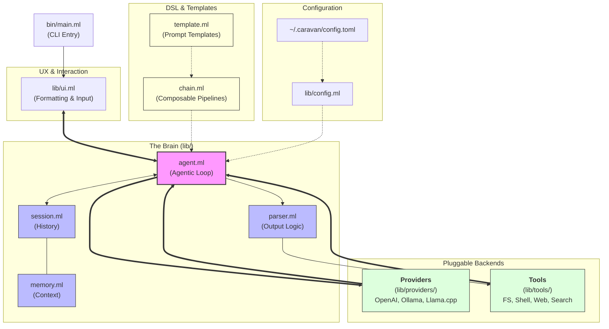

# Caravan Project Architecture

This document provides a high-level overview of the Caravan project structure and how the different components interact to create an agentic loop.

## Key Components

- **Agentic Loop**: The core recursive engine that manages turns between the user, the LLM, and tool execution.
- **Providers**: Standardized interface for different LLM backends.
- **Tools**: Atomic capabilities that the agent can "call" to interact with the real world (filesystem, network, etc.).
- **Session/Memory**: Maintains the state and context of the conversation. Decoupled using OCaml 5 first-class modules (`Memory.packed_memory`) to support pluggable backends such as `Buffer` (local sliding-window buffer), `Redis_store` (externalized inter-agent/multi-process shared context), and `Hierarchical` (automatic LLM-powered context compression to prevent context blow-up).
- **Parser**: Responsible for extracting structured tool calls from raw LLM text responses.
