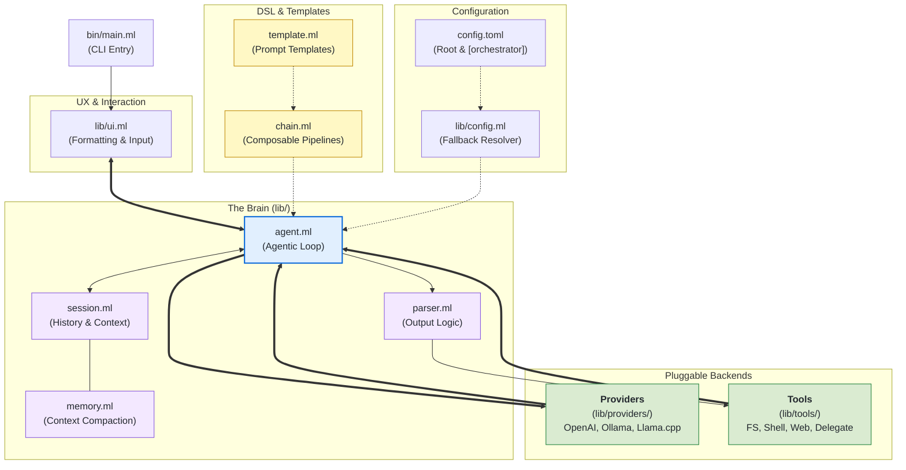

# Caravan Project Architecture

This document provides a high-level overview of the Caravan framework architecture and component interactions.

```mermaid
flowchart TB
    %% Nodes
    Entry["bin/main.ml<br/>(CLI Entry)"]
    
    subgraph UI_Layer ["UX & Interaction"]
        UI["lib/ui.ml<br/>(Formatting & Input)"]
    end

    subgraph Orchestrator ["The Brain (lib/)"]
        Agent["agent.ml<br/>(Agentic Loop)"]
        Session["session.ml<br/>(History & Context)"]
        Memory["memory.ml<br/>(Context Compaction)"]
        Parser["parser.ml<br/>(Output Logic)"]
    end

    subgraph DSL_Layer ["DSL & Templates"]
        Chain["chain.ml<br/>(Composable Pipelines)"]
        Template["template.ml<br/>(Prompt Templates)"]
    end

    subgraph Interface ["Pluggable Backends"]
        direction LR
        Providers["<b>Providers</b><br/>(lib/providers/)<br/>OpenAI, Ollama, Llama.cpp"]
        Tools["<b>Tools</b><br/>(lib/tools/)<br/>FS, Shell, Web, Delegate"]
    end

    subgraph Settings ["Configuration"]
        TOML["config.toml<br/>(Root & [orchestrator])"]
        Config["lib/config.ml<br/>(Fallback Resolver)"]
    end

    %% Connections
    Entry --> UI
    UI <==> Agent
    
    Agent <--> Session
    Session --- Memory
    
    Agent ==> Providers
    Providers ==> Agent
    
    Agent --> Parser
    Parser --> Tools
    Tools ==> Agent

    Chain -.-> Agent
    Template -.-> Chain

    TOML -.-> Config
    Config -.-> Agent

    %% Styling
    classDef primary fill:#e1effe,stroke:#0969da,stroke-width:2px,color:#24292f;
    classDef secondary fill:#f3e8ff,stroke:#8250df,stroke-width:1px,color:#24292f;
    classDef interface fill:#daebd1,stroke:#1a7f37,stroke-width:1px,color:#24292f;
    classDef dsl fill:#fff8c5,stroke:#bf8700,stroke-width:1px,color:#24292f;
    
    class Agent primary;
    class Session,Memory,Parser secondary;
    class Providers,Tools interface;
    class Chain,Template dsl;
```

## Key Components

- **Agentic Loop (`lib/agent.ml`)**: Autonomous engine executing tool-calling turns until completion or max turns limit. Automatically recognizes direct text responses without tool calls to prevent infinite looping.
- **Config Resolver (`lib/config.ml`)**: Centralized configuration resolver supporting root TOML settings, `[orchestrator]` tables, environment variables, and fallback defaults.
- **Providers (`lib/providers/`)**: Pluggable implementations for OpenAI, local Ollama, llama.cpp, and generic OpenAI-compatible endpoints.
- **Tools (`lib/tools/`)**: Modular capabilities available to agents (e.g. `read_file`, `write_file`, `bash`, `delegate`, `finish`).
  - **`delegate`**: Spawns cold-start subagents with isolated context and validated toolsets.
- **Session & Memory (`lib/session.ml`, `lib/memory.ml`)**: Decoupled state management supporting sliding-window buffers, Redis shared stores, and automatic context compaction.
- **Parser (`lib/parser.ml`)**: Type-safe output parsing and JSON combinators.
